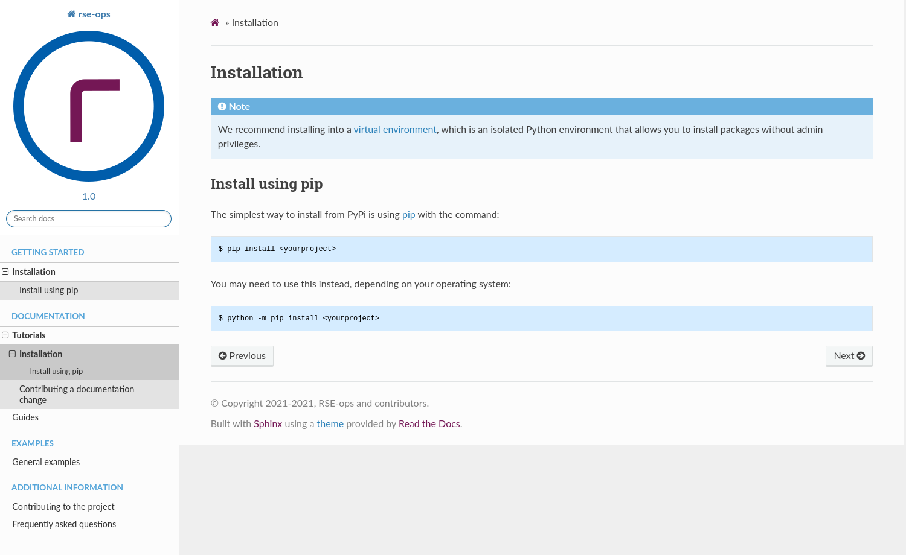
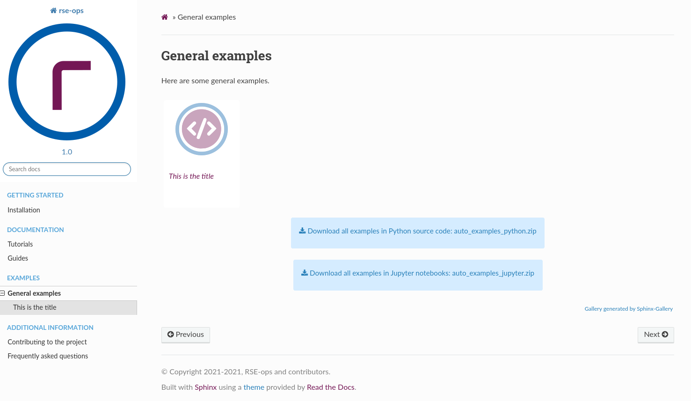

# RSE-ops Readthedocs


This is a documentation template that can be deployed to read-the-docs, or
if built and pushed manually, to GitHub pages. [Readthedocs](readthedocs.org/) is nice because
it will maintain a record of previous versions. The template is provided in
the [docs](docs) folder as very likely you will maintain the documentation alongside
your code (recommended).

🚧️ **under development** 🚧️

## Features

 - Markdown or Restructured syntax
 - Python gallery with examples (if you have a Python project)

Here is the basic template design - we use a predominance of blue and white, with accents
in gray and bits of RSE purple:



And here is how the examples in [examples](examples) show up in the docs.



The cool thing about the examples (other than being in the repository root and showing
up in the docs) is that they are downloadable as a Python file, a Jupyter notebook,
or an entire zip file.

## Install

To install dependencies:

```bash
$ cd docs
$ python -m venv env
$ source env/bin/activate
$ pip install -r requirements.txt
```

At this point, you'll want to edit [conf.py](docs/conf.py) to add the correct GitHub links
and metadata for your project. If you have a Python project and include docstrings, you might even want to
add it to the requirements.txt and import it there. We also support both markdown
and restructured syntax (rst) depending on the file extension. To see tricks for
using markdown, see [this guide](https://myst-parser.readthedocs.io/en/latest/syntax/optional.html).
If you have existing rst docs to convert to markdown, see [this tool](https://github.com/executablebooks/rst-to-myst).

To build the documentation run:

```bash
$ make html
```

To clean up old generated files and start again:

```bash
make clean
```

And then to preview the built docs:

```
cd _build/html
python -m http.server 9999
```

Then open your browser to [http://127.0.0.1:9999](http://127.0.0.1:9999)

## Deploying

### Deploy to ReadtheDocs

The easiest thing to do is have an automated build deployed to readthedocs.
You can login there, connect the repository, and then configure the build.
Given that the requirements.txt is in the root of your docs folder (alongside the conf.py)
you shouldn't need to tell Readthedocs where it is. However, if you change this location
or the name of the file, you will need to go into "Advanced Settings" and for "Requirements file"
put docs/requirements.txt. Otherwise, the extra modules will not be installed and the docs cannot
be built! After you have made this connection, any push to main will re-render the
docs. You can see the example docs on ReadtheDocs [here](https://rse-ops-readthedocs.readthedocs.io/en/latest/).

### Deploy to GitHub Pages

A [.github/workflows/build-deploy.yaml](.github/workflows/build-deploy.yaml) is provided
that will build your docs on a PR, and deploy on merge to main. You can customize the triggers
and the branches, if desired. Please [open an issue](https://github.com/rse-ops/readthedocs-theme/issues) if you need any help.


License
-------

Copyright (c) 2017-2021, Lawrence Livermore National Security, LLC. 
Produced at the Lawrence Livermore National Laboratory.

The RADIUSS documentation is licensed under the MIT license [LICENSE](./LICENSE).

Copyrights and patents in the RADIUSS project are retained by
contributors. No copyright assignment is required to contribute to RADIUSS
Docker.

This work was produced under the auspices of the U.S. Department of
Energy by Lawrence Livermore National Laboratory under Contract
DE-AC52-07NA27344.
